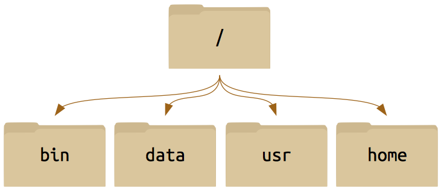
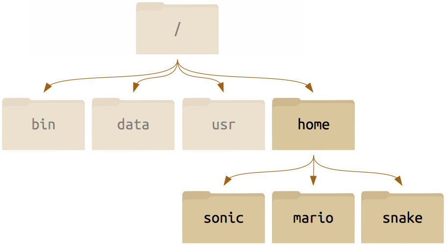
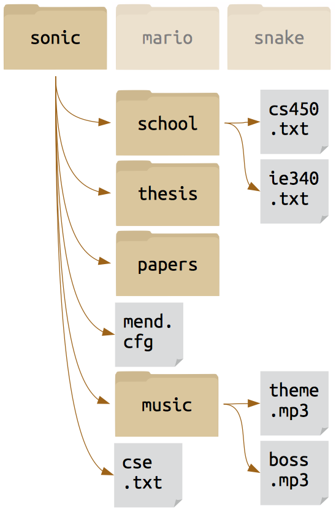
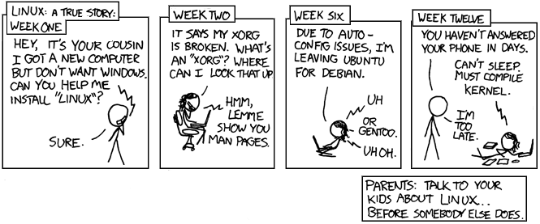

# Introduction to Bash (The Linux Command Line)

## Contents
- **<a href="#intro" style="text-decoration:none; color:black;">Introduction</a>**

- **<a href="#filesfolders1" style="text-decoration:none; color:black;">Files and Directories</a>**

- **<a href="#filesfolders2" style="text-decoration:none; color:black;">Manipulating Files and Directories</a>**

- **<a href="#pipesfilters" style="text-decoration:none; color:black;">Pipes and Filters</a>**

-  **<a href="#shellscripts" style="text-decoration:none; color:black;">Shell Scripts</a>**

- **<a href="#findingthings" style="text-decoration:none; color:black;">Finding Things</a>**

## <a href="#contents" style="text-decoration:none; color:black;">Introduction</a>
A **shell** is a computer program that let's the user interact with the operating system through a set of commands.
The user must type the commands and send them for execution by pressing the `Enter` key.
The commands are usually typed in a so-called **command line**.

While most computers have graphical user interfaces (GUI), shells only have a textual interface.
The textual interface may seem cryptic at first but it can be very useful due to its high action-to-keystroke ratio, its support for automating repetitive tasks, and it can also access networked machines.

There are a number of shell programs out there.
The most popular one is **Bash**, which stands for **B**ourne **A**gain **SH**ell -- the successor of and replacement for the Bourne Shell.
To begin, let's figure out which shell we are using by typing `echo $SHELL` in the command line:

	$ echo $SHELL
	/bin/bash

`echo` is a command that prints a string to the terminal. In this case the shell printed the environment variable `$SHELL`. We can also tell the shell to print anything we like such as

	$ echo Hello World!
	Hello World!

To print to the screen who the current user is type `whoami` and your LoginID should be printed to the terminal. If you are using your personal computer then the username will be printed to the terminal.

	$ whoami
	<LoginID>

Similarly, if we wanted to know who else was logged into the computer type `who` and a list of the users should print to the terminal. We could also use the `date` command to print the current date and time.

		$ date
		Wed Dec 31 06:00:00 CST 1969

While this workshop will not cover every command the `man` will become your best friend. The `man` command prints to the screen the manual page for all other commands recognized by the shell. For example:

	$ man mv

	NAME
		mv - move (rename) files
	SYNOPSIS
		mv [OPTION] ... [-T] SOURCE DEST
		.
		.
		.

This command will help you later on when you want to figure out how to use a specific command.

## <a href="#contents" style="text-decoration:none; color:black;">Files and Directories</a>

In the last section we answered the questions `who`, what (`$SHELL`), and when (`date`), so now it's time to discuss the question _where_? When moving around a Linux system you will be encountered by files and directories. The Linux system considers everything to be a file with directories being files that contain files. The following section will discuss how to file system is set up and how to navigate the file system.

The first thing we probably want to know is where are we within the file system. The command `pwd` will **p**rint the **w**orking **d**irectory. For example:

	$ pwd
	/home/<LoginID>

It is important to note that the directory that is printed to the terminal starts with `/`. This refers to the root directory, or the outermost directory while everything after a `/` is a subdirectory. In this case the `LoginID` is a subdirectory of `home` and so on.

When referring to the location of a file or directory there are two ways in which you can reference the path to the file. The *absolute* path refers to a file or directory from the root directory. The *relative* path refers to a file or directory from the current directory.

### Unix File System

* All of the directories are descended from the master **root** directory `/`.
* Each of the top-level directories descend directly from the **root** `/`. There are many other standard directories on Unix-derived systems: `/usr`, `/bin`, `/opt`, *etc.*)

 

---

 

#### Within any one of these folders we can identify a subsidiary structure:

 

---

 

And then we can drill down all the way to something that perhaps looks more familiar to you, a home directory populated with files just like you may treat the **My Documents** folder on Windows.

To navigate this system on the command line (as opposed to in a file browser), you only need a few basic commands: `pwd` ,`ls` ,`cd`.

You already learned that `pwd` prints the working directory. To list the contents within a directory use the `ls` command. For example, typing `ls` in the "root" directory:

	$ ls
	bin	data	home	usr

Often a command will take options or flags which begin with `-`. Type `ls -l` to print a long list of the contents within a directory.

	$ ls -l
	total 2
	drwxrwxr-x  2 peetz  wheel  2 Apr  6 09:56 bin
	drwxrwxr-x  2 peetz  wheel  2 Apr  6 09:56 data
	drwxrwxr-x  5 peetz  wheel  5 Apr  6 09:57 home
	drwxrwxr-x  2 peetz  wheel  2 Apr  6 09:56 usr

Other flags such as `-a`,`-t`, or `-r	` display the same contents with some modifications (Refer to the `man` pages for a full list of all the flags). The `-a` flag will display all files including the hidden files.

	$ ls -a
	.	..	bin	data	home	usr

To physically move from one directory to another you can use the `cd` command, as in **c**hange **d**irectory. This can be used in the following way:

	$ cd home/sonic

Notice that the current directory has changed. We can direct `cd` to a directory through an absolute path. For example:

	$ cd /home/$USER/sonic/music

A few handy shortcuts when moving around the file system:

`.` refers to the current directory

`..` refers to the directory above the current directory

`~` refers to the home directory

*Tab completion* will become your best friend when using a linux system. When typing a path becomes tedious you can use tab completion to auto-complete the directory or file. This becomes especially useful for long paths and filenames.

### Do [Exercise #1](./ex1.html)

## <a href="#contents" style="text-decoration:none; color:black;">Manipulating Files and Directories</a>

Over time you will start manipulating files and directories. This will include creating, copying, moving, removing and renaming files and directories. It is essential to have an organized file system especially when you start dealing with multiple files from multiple processes. This section will discuss the basic simple commands necessary to manipulate files and directories.

The first basic command is `mkdir`. This command **m**a**k**es a **dir**ectory in the file system. Like many other commands there are multiple flags that can be used with this command, however the basic usage is `mkdir directory_name`. For example:

	$ ls
	boss.mp3	theme.mp3
	$ mkdir lyrics
	$ ls
	boss.mp3	lyrics	theme.mp3

To **c**o**p**y a file or directory you can use the `cp` command. This second basic command allows the user to copy a file or directory and specify a destination. This command has the format `cp source destination`. For Example:

	$ ls
	boss.mp3	lyrics	theme.mp3
	$ cp theme.mp3 menu.mp3
	boss.mp3	lyrics	menu.mp3	theme.mp3

The next basic command is `mv` which easily enough stands for **m**o**v**e. Similar to `cp` in this command you specify a source and a destination however unlike `cp` it will only keep the destination. For this reason `mv` is used to rename files. To move a file you can type the following in the command line:

	$ cd ..
	$ ls
	cse.txt	mend.cfg	music	papers	school	thesis
	$ mv cse.txt school/
	$ ls
	mend.cfg	music	papers	school	thesis
	$ cd school
	$ ls
	cs450.txt	cse.txt	ie340.txt

Notice that the file `cse.txt` is no longer in the `sonic` directory but instead in the `school` directory. To rename a file you can specify the `source` as long as the source is not within the current directory. For example:

	$ ls
	cs450.txt	cse.txt	ie340.txt
	$ mv cse.txt cse401.txt
	$ ls
	cs450.txt	cse401.txt	ie340.txt

Finally there a few different ways to remove a file or directory. For example:

	$ cd ..
	$ ls
	mend.cfg	music	papers	school	thesis
	$ rm mend.cfg
	$ ls
	music	papers	school	thesis
	$ rm thesis
	rm: thesis: is a directory

You cannot simply remove a directory using the `rm` command. It turns out that to remove a directory there are is a special `rmdir` command.

	$ rmdir thesis
	$ ls
	music	papers	school

Another option is to use the flag `-d` or `-r` which attempts to remove directories as well as other file types. For example:

	$ rm -d papers
	$ ls
	music	school

We now know how copy, move, rename, and remove a file. But what about creating a new file? There are a few different ways you can create a new file. To create a blank file you can use the `touch` command. For example:

	$ cd school
	$ touch ae410.txt
	$ ls
	ae410.txt	cs450.txt	cse401.txt	ie340.txt

In some cases the `touch` command is used to update the timestamp on a file if the file already exists.

To open a new file you can use a different editors. For example if I wanted to open a new file and begin editing it I could use the text editors `vi`, `vim`, or `nano` among others. In this case lets use `nano` to open a new file called `me570.txt` (when done, press `ctrl`+`x` to close and save the file by following the prompts on the bottom of the screen):

	$ nano me570.txt

The `cat`, `more`, and `less` commands allow you to view but not edit a file. For example if we want to view the file `me570.txt` we can:

	$ cat me570.txt
	This is what is inside the me570.txt file.

Lets say that there are a lot of files that you want to copy, move, rename, or remove. We can use what are called *Wildcards*.

- `*` - represents zero or more characters
- `?` - represents a single character
- `[]` - represents a range of characters

These commands allow the user to ask for a specific pattern or set of files and directories. For example lets say we want to know what files we have that start with the letters `cs` we can use the `*` command.

	$ ls cs*
	cs450.txt	cse401.txt

Let's say we create a directory to store old files, named `old`:

	$ mkdir bold
	$ ls
	ae410.txt	cs450.txt	cse401.txt	ie340.txt	me570.txt	old

If we cant to find all files that have exactly 3 characters as an extension we can use the `?` command:

	$ ls *.???
	ae410.txt	cs450.txt	cse401.txt	ie340.txt	me570.txt

The last wildcard listed above is the `[]` command which can be used to specify a list of characters that you want to find. For example if you want to remove all files that start with the letter **a** and **c** you can type in the command line

	$ ls
	ae410.txt	cs450.txt	cse401.txt	ie340.txt	me570.txt	old
	$ rm [ac]*
	$ ls
	ie340.txt	me570.txt	old

As a reminder if there is a command that you don't know exactly how to use or if you want to find out what the flags are reference the `man` pages.

### Do [Exercise #2](./ex2.html)

## <a href="#contents" style="text-decoration:none; color:black;">Pipes and Filters</a>

When we type a command or run a program we will get an output printed to the terminal. Pipes can redirect a command or a program's output to a file for future reference or to be used at a later time. In this section you will learn how to use the pipes and how to combine pipes into powerful single-purpose programs.

The first command to learn is `>`. This pipe, used as `command > file` redirects a command's output to a file. For example:

	$ cd ../music
	$ ls  
	boss.mp3	lyrics	menu.mp3	theme.mp3
	$ ls > output.txt
	$ cat output.txt
	boss.mp3
	lyrics
	menu.mp3
	theme.mp3

Sometimes you run into the problem of redirection multiple outputs to a single file. If you use the `>` command the original file contents will be overwritten. To append new outputs to a file you can use the command `>>`. For example:

	$ cat output.txt
	boss.mp3
	lyrics
	menu.mp3
	theme.mp3
	$ echo Hello! >> output.txt
	$ cat output.txt
	boss.mp3
	lyrics
	menu.mp3
	theme.mp3
	Hello!

If you would like to read the contents of a file to use in your command you can use the `<` command. In this case instead of redirecting an output to a file you are redirecting a file's contents into the input of command. For example:

	$ sort < output.txt
	boss.mp3
	Hello!
	lyrics
	menu.mp3
	theme.mp3

Sometimes in order to combine two command line steps you can use a pipeline. That is you can use the output of one file into the input of another file using the `|` command. For example:

	$ ls > output.txt
	$ cat output.txt | head -3
	boss.mp3
	lyrics
	menu.mp3

### Do [Exercise #3](./ex3.html)

## <a href="#contents" style="text-decoration:none; color:black;">Shell Scripts</a>

There will come a time when using bash that typing in specific commands in the command line will become cumbersome. This is where shell scripts come in. A user can write a series of commands in a shell script that the computer will then execute sequentially. It is important to know that commands that work on the command line will work the same way when implemented in a script. Likewise if a series of commands are implemented in a script, the same result will occur if the user inputs the commands manually in the command line. The following section will introduce the concept of shell scripts, how to write them, and how to execute them.

Consider the following simple script (found in the `bin` directory):

	#!/usr/local/bin/bash
	echo This script lists the files in the directory
	ls

Lets break down the script and how its works. In the first line you'll see `#!/bin/bash` is written. Every shell script should start with this exact line, known as the shebang line. This line tells Linux which interpreter to use for this file. The second command is the `echo` command which prints everything that follows it. And finally we have the `ls` command which just lists the directory. If a user were to execute this series of command manually it would look like this:

	$ echo This script lists the files in the directory
	This script lists the files in the directory
	$ ls
	bin data home usr

Remember that Linux is an extensionless system therefore when writing a shell script you don't have to append the `.sh` extension, however doing this will help you identify which files are shell scripts and which are not.

In a shell script lines that start with `#` are considered comments and will not be interpreted. There are some exceptions however, including the first line of every script.

You can also declare variables within a shell script. This can be done in the following way:

	#!/usr/local/bin/bash
	# Declare variable
	str='Hello World!'
	echo $str

Notice that when we are defining the variable there are no spaces on either side of the `=` sign. Additionally when you want to refer to the variable you have to place `$` sign right in front of the variable to signify that you are referring to a variable. The previous script will output:

	$ ./script.sh
	Hello World!

To run the shell script we typed `./` and then the filename. Remember a few sections back that `.` specifies the current directory. When executing a shell script you are essentially telling the computer that the script you are attempting to execute is in the current directory. An absolute path would also work. If the script in is the directory above your current directory you could use `../` to run the script.

It may be the case that when you write a shell script your system does not yet know it's an executable script. To change this adjust the permissions on the file by typing:

	$ chmod +x script.sh

There are a few automatically set variables when running a script. These are:

`$0`: The script filename

`$1`...`$9`: The command line arguments

`$#`: The number of command line arguments

`$*`: All of the command line arguments

As in any other programming language you can also implement `if`,`else`,`fi` statements, `for` loops, and `while` loops. For example you can write the following in a script:

	#!/usr/local/bin/bash
	count=100
	if [ $count -eq 100 ]
	then
		echo "Count is 100"
	else
		echo "Count is not 100"
	fi

This script defines the variable `count` and executes the `echo` command if the variable `count` equals a certain value. Notice that the statement ends with `fi`. Sometimes it is useful to run a command until a certain requirement is met. For example, lets consider the following `while` loop:

	#!/usr/local/bin/bash
	n=1
	while(($n <= 5))
	do
		echo "This loop has run $n times"
		n=$((n+1))
	done

The output of this script will be:

	This loop has run 1 times
	This loop has run 2 times
	This loop has run 3 times
	This loop has run 4 times
	This loop has run 5 times

Take a look at the structure of the while loop. The basic structure of the while loop can be broken down to:

	while <condition>
	do
		<commands>
	done

Similar to the `while` loop, the `for` loop will execute a command a command a number of times. However instead of executing the command until a condition is met a `for` loop will only execute the command for a pre-specified number of times. For example:

	#!/usr/local/bin/bash
	for n in {1..5}
	do
		echo "This loop has run $n times"
	done	 

This loop will produce the exact same result as the `while` loop. However you are not limited to just numerical values. You can also execute a command based on the items within a variable. This could be

	names='Name1 Name2 Name3'

More advanced loop could include the `break` and `continue` commands. The `break` command tells bash to exit the loop when a condition is met. The `continue` command tells bash to skip the current iteration and move on to the next iteration within the loop. For example:

	#!/usr/local/bin/bash
	for value in {1..10}
	do
		if [ $value -eq 5 ]
		then
			echo The current count is $value
			continue
		fi
		if [ $value -eq 7 ]
		then
			echo The count is $value
			echo Now exiting loop
			break
		fi
	done

You can also prompt the user to select from a list of choices using the `select`,`do`,`done` sequence. For example the following script will prompt the user to run or quit:

	#!/usr/local/bin/bash
	options='Continue Quit'
	PS3='Choose 1) or 2) to Continue or Quit: '
	select option in $options
	do
		if [ $option == 'Continue' ]
		then
			continue
		fi
		if [ $option == 'Quit' ]
		then
			break
		fi
	done

### Do [Exercise #5](./ex5.html)

## <a href="#contents" style="text-decoration:none; color:black;">Finding Things</a>

In this last section of the tutorial you are going to learn about finding useful data within your files.

The first command and most powerful is the `grep` command. Lets say you want to find the line within a file that contains a specific string. We can then use the `grep` command to print that whole line to the terminal. For example lets consider the following file and its contents:

	$ cat example.txt
	This line is about cars.
	This line is about airplanes.
	This line only has one sentence.

If we wanted to print to the terminal the line that mentions the string `airplanes` then we can type the following command:

	$ grep 'airplanes' example.txt
	This line is about airplanes.

We could also print to the terminal which line the string is in:

	$ grep -n 'airplanes' example.txt
	2:This line is about airplanes.

You can refer to the `man` pages to see all of the available flags with this command.

Another useful command is the `wc` command. This command will output the word, line, character, and byte count of a file. The information printed can be adjusted based on what flags are attached when typing the command. For example if we want to know the line count of a file:

	$ wc -l example.txt
		3 example.txt

These commands start to become powerful when you have a large amount of files that you want to look through. For example lets you that you have a large amount of files with the *.txt extension and you want to find the number of lines in each of them and print the results to a file. You can type the following

	$ wc -l *.txt > length

Another useful command is the `find` command. This command will isolate specific files that it **finds** and execute a specific command to those files. For example if you want to `rm` all files that fit the `find` condition then you could type:

	$ find ~/ -name '*.txt' -exec rm {} \;

### Do [Exercise #6](./ex6.html)

# Congratulations! Now you are a Linux-guru*!

