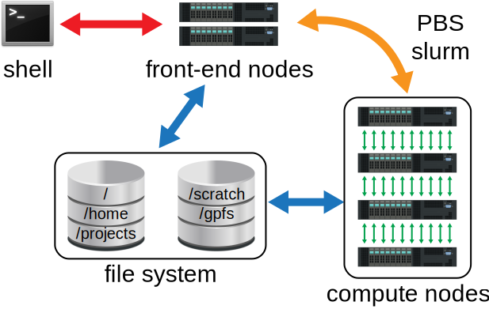

[](http://uwm.edu/hpc/support)

# Mortimer Cluster


[_The Mortimer Cluster_](login.mortimer.hpc.uwm.edu) is a campus-wide resource for high-performance computing located at the University of Wisconsin-Milwaukee, available to researchers.



A cluster is typically organized as a group of connected computer _nodes_, or processing units with memory and network access (basically all modern supercomputers are clusters^([Top500](http://www.top500.org/lists/2015/11/)) ). A node is much like your laptop or desktop machine, except instead of communicating with the outside world through a keyboard or monitor it only has a network connection. These network connections are used to coordinate processes running across groups of nodes as so-called parallel programs.

To access a cluster, you use a program called a _shell_. Typically, a shell consists of a command line which allows you precise control over the tasks you invoke, the jobs you run, and the files you create.  If you've worked on a GNU/Linux system before, this should be a familiar concept to you; if not there are various online resources on using shell, including our first workshop.

The shell allows you to access the _head nodes_, which are the public interface to the cluster.  From these head nodes, you can submit lengthy and computationally intensive _jobs_ to the _compute nodes_, which carry out the massively parallel calculations necessary for your research.

A job or _batch file_ is simply a short script of the commands necessary to run your code.  The compute nodes can then set up the libraries and environment necessary for execution and carry out the calculation.  The script can also instruct the cluster what to do with the results of the calculations.

In addition, a file system is attached for the storage of programs and data over the short and long term.


## Getting Started

In order to use Mortimer, you need: computer with internet access, a _user account_ on Mortimer, and a _shell_ (or its emulator if you are on a Windows machine).

### User Accounts

<!--If you do not have a user account yet, you are free to use a training guest account from the list below.  (These are sandboxed accounts which have restricted privileges, but can be used to complete the exercises in this workshop.) -->

If you would like a personal account, you can obtain one through your research group by contacting [research-computing@uwm.edu](mailto:research-computing@uwm.edu) or by [requesting access](https://uwm.edu/hpc/getting-started/) on the UWM High Performance Computing page.

### Shell

Depending on your computer's operating system, a few options are available to you.

-   **Windows**:  While the command prompt is inadequate (since it supports DOS-like instead of Unix-like commands), a number of options are available on Windows.
    -   [MobaXTerm](http://mobaxterm.mobatek.net/) is a clean and simple client for connecting to remote servers.  This is our recommendation if you need to use Mortimer from a Windows-based machine.
    -   [PuTTY](http://www.chiark.greenend.org.uk/~sgtatham/putty/) is the classic standard for secure shell access on Windows.  (Be careful, however:  there is a malicious version online as well<sup>[[Paganini2015]](http://securityaffairs.co/wordpress/37013/cyber-crime/malicious-putty-in-the-wild.html)</sup>!)
    -   [Cygwin](https://www.cygwin.com/) is a powerful recreation of Unix-like system features on a Windows machine, but is overkill if all you require is secure shell access to a remote cluster.
    -   [PowerShell](https://technet.microsoft.com/en-us/library/ee221100.aspx) has the advantage of being built into Windows out of the box, but has an unusual syntax that is incompatible with learning a Unix-like shell.  Feel free to explore this option (since it is quite powerful), but we won't address it further in this document.

-   **Mac OS X**:  You need to access the Terminal.  Press `⌘``Space` to open Spotlight and then type `terminal`.  Press `Return` to open the highlighted application.
    

-   **Linux**:  You're good to go.  Just find the "command line" or "terminal" option in your menu.  If it's not on the menu bar itself, take a look under "Applications" or the equivalent menu.

>Although there are subtle differences, you will often hear "terminal", "command line", "shell", "prompt", and "bash" used interchangeably.

Once you have a shell open, it's time to log in for a first look at the cluster environment.

### Logging On

In your command window, you will see a _prompt_ which looks something like `yourusername@machine:directory $ `. (There are a lot of variations on this.)

After the `$`, type `ssh <user>@login.mortimer.hpc.uwm.edu`, where `<user>` is replaced by the actual user name of the account you are using to access the cluster, for Mortimer this is your ePantherID.

```bash
$ ssh NetID@login.mortimer.hpc.uwm.edu
NetID@login.mortimer.hpc.uwm.edu's password:
```

The machine will ask you for a password in response; enter the associated password and press `Return`. Additionally, sometimes the machine will ask you a question about [RSA security](https://en.wikipedia.org/wiki/RSA_(cryptosystem)) which you can answer `yes` to; this should only happen once on a given machine.

You should now be logged in.  What this means is that commands you enter into this shell are interpreted not by your home machine, but by the remote cluster's login nodes.

> If you are having difficulty with the password after a couple of tries, please contact [research-computing@uwm.edu](mailto:research-computing@uwm.edu). Note that after 3 failed login attempts, your IP address may be blocked from further login attempts as part of a security protocol. Contact [research-computing@uwm.edu](mailto:research-computing@uwm.edu) to have the block removed.

### First Look Around

A short message appears, nominally welcoming you to the cluster but also including a warning about data backup. Your shell is now logically situated in your _home directory_, which is represented by the shorthand `~`.  If you type `pwd`, short for "**p**rint **w**orking **d**irectory", then you can see exactly where that home directory is located with respect to the root directory `/`.  If you type `ls`, the files in your home directory will be **l**i**s**ted for you.

Other standard shell commands are available as well.  If you are familiar with these, you can play around a little now; otherwise, please check out the first workshop in this series on bash. In any case, when you are done, type `exit` at the prompt to leave Mortimer and return to the context of your home machine.

## Environment

The environment around any cluster is similar to that of any Linux system. In this case you're logging into a computer through a network. Otherwise the same rules apply. (In order to effectively learn the shell, check out SWC, HPCUniversity, etc.)

### Looking and Moving Around
Once you're logged on you will notice that the same shell commands apply. Typing `pwd` will still print the working directory, `ls` will still list the directory contents. Likewise if you want to change the directory you can type `cd` etc.

The main difference is that you are now working on a remote computer. Notice that you typed `ssh`, or **s**ecure **sh**ell, to log on to Mortimer. This is just allows you to connect securely to a networked machine over an unsecure network. In order to exit Mortimer you just type `exit` or `logout`. If you are on a Windows machine make sure you click on the `ssh` option under `connection type` and type in the host name (login.mortimer.hpc.uwm.edu)

### Filesystem
Once you're inside your home directory on Mortimer you'll notice that you have a couple of folders. There is a very small quota on your `/home` directory and the IO speeds on this drive are slow enough to bottleneck any programs writing to this directory. All users have a `Data` symlink within their home directory that points to a directory one of the RAID (**R**edundant **A**rrays of **I**ndependent **D**isks) drives. This directory has a much larger storage and should be used to run your code in and store your (probably large) output files.

Since you're running your code on a networked machine you cannot simply click and drop files into your `scratch` folder from your laptop or desktop machines. To move files to and from Mortimer you can use the command `scp` and it can be used in numerous ways with the two most common being:

Copy file from remote host to local host

```bash
$ scp -P <port number> ePantherID@login.mortimer.hpc.uwm.edu:file1.txt /some/local/directory
```

Copy file from local host to remote host

```bash
$ scp -P <port number> file1.txt ePantherID@login.mortimer.hpc.uwm.edu:/some/remote/directory
```

Note the `-P <port number>` near the beginning of the command. Mortimer is set up to support port-forwarding to reduce traffic on the login node. Each raid drive accepts traffic directly from port `220<raid-number>`, so for example if your Data directory links to raid-11, you would use port 22011.

If you are moving dozens of very large data files this process can be very slow. To help speedup the process you can use file transfer protocol software such as Filezilla, WinSCP, rsync, gFTP, etc. Be sure to specify the proper port mentioned above when using any of these file transfer utilities.

### Modules
Sometimes the environment that a researcher doing molecular dynamics is quite different from a that of someone doing computational fluid dynamics. To modify your environment variables you can use the `module` command. To print the list of current modules you can use the `module list` command. If you want to load a module that you do not currently have you can use the `module load` command, such as:

```bash
$ module load matlab/2020b
```

You can also load your modules by editing your `.bashrc` file.

## Running Code

We will use example codes obtained as follows to illustrate compiling, queueing, and running code on Mortimer.

```bash
$ module load pkgsrc/2020Q4
$ git clone https://github.com/darinpeetz/Submission_Example.git
```

### Queueing
Fairshare queuing divides requested resources among system users or groups (rather than just between processes).  It incorporates the historic behavior of a user and group into job priority decision making.  In principle, this allows groups and users to fairly access the resource.  However, this can be frustrating for a new user to understand, particularly when one has a number of jobs in the queue and it takes a long time for them to run.

The following command are the basic batch job commands to submit, check on, or delete a batch job on Mortimer.

Command       | Description
------------- | -------------
sbatch        | submit batch job
squeue        | query status of batch job
scancel       | delete bactch job

### Compiling
If you're writing scientific code, you're almost definitely using C/C++, Fortran, Matlab, or Python, so it behooves us to check and see what the options for those are.

Language | Compilers
-------- | ------------
C/C++    | `icc`/`icpc` and `gcc`/`g++`
Fortran  | `ifort` and `gfortran`

For Matlab, we currently have versions 2015a, 2018a, 2019b, and 2020b available on the cluster, though only 2020b has all the proprietary toolboxes available. For Python users, we generally recommend that each user/group setup their own conda installation to avoid package collisions. Libraries are also available; for instance, the Intel MKL. You can see what is required to compile with it on a specific system using the [command-line flag tool](https://software.intel.com/en-us/articles/intel-mkl-link-line-advisor/).

### Installing
As you do not have administrator privileges on Mortimer, you won't be able to `make install` your software.  Instead, you'll likely want to set up a "local" installation for yourself:  create and add to your `$PATH` appropriate directories like `~/Data/bin`.
>   Subsequent to a successful installation, you can create a `modulefile` which works with `module` to update the environment for other users of your software application.

This machine was jointly purchased by many investors, who each contributed an amount to the total capital hardware investment and are thus entitled to a perpetual share of the available computational power.

### Node Access Policy
Unlike some other clusters, by default Mortimer allows for users to share access to the same node if both users don't need to use all of the cores. IF something requires you to have sole access to a node (often memory constraints), you can add the `--exclusive` flag to ensure no other jobs will be allocated on that node.

## A Friendlier cluster
You can modify your `.bash_profile` file to include things like color in your directory listing or shorten some commands. For example you can write

```bash
	# .bash_profile

	alias ls='ls --color=auto'
	alias q="qstat -u $USER"
```

For more user resources you can visit the UW-Milwaukee High Performance Computing [website](https://uwm.edu/hpc). Here you will find guides and specifications for the hardware.

-   [Summary Handout](https://panthers-my.sharepoint.com/:w:/g/personal/peetz_uwm_edu/ERngIOpN4fJMr84z653qmogB0xBe_7OImsnwYYjc3Cvknw?e=B3hQcY)

## Credits

Neal Davis developed these materials for [Computational Science and Engineering](http://cse.illinois.edu/) at the University of Illinois at Urbana–Champaign.  Some tips were suggested by Jay Alameda and Mark van Moers of NCSA.  In addition, the support of NCSA and Campus Cluster personnel such as Wayne Hoyenga, Martin Biernat, and Kandace Turner-Jones, has also been invaluable.


This content is available under a [Creative Commons Attribution 4.0 Unported License](https://creativecommons.org/licenses/by/4.0/).

[](http://uwm.edu/hpc/support)
